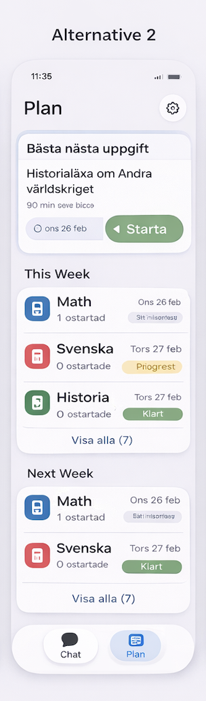

# be-7hw — Plan tab readability & polish

## Alternative 2 (reference)

- **Goal**: improve Plan tab information hierarchy with compact best-next presentation, week sections, and clearer status affordances.
- **Screenshot**: add the image file at `designs/be-7hw/alternative2_plan_tab.png` and it will render below.



## Notes

- This design includes a compact **Best next** card. The current epic `be-7hw` requires: *remove the large Best Next block* and *highlight best next inline*.
  - Treat this card as a *visual reference* for typography/spacing/badges; implementation should still satisfy the ticket requirements (inline highlight).

## Sample SwiftUI (prototype)

The following prototype was provided to illustrate the intended component structure (subject badge, status pill, grouped section cards, compact CTA):

```swift
// See conversation: be-7hw Alternative 2 prototype (BestNextCompactCard, WeekSection, AssignmentRow, SubjectBadge, StatusPill)
```


