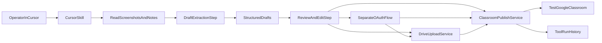

# Classroom Test Seeder Plan

## Goal

Build a safe, repeatable workflow that:

- accepts screenshots plus short operator notes
- extracts structured coursework drafts
- lets us review/edit the drafts
- publishes them into a dedicated teacher-owned Google Classroom test course
- stays fully separate from the production StudyBuddy app implementation
- is primarily operated from Cursor through a reusable Skill

## Current State

The repo already has Google sign-in and Classroom read access:

- [backend/app/routes/auth_google.py](/Users/hedman-admin/study-buddy/backend/app/routes/auth_google.py): OAuth + PKCE flow, but only `readonly` Classroom scopes today
- [backend/app/services/classroom.py](/Users/hedman-admin/study-buddy/backend/app/services/classroom.py): reads courses, assignments, materials, and announcements
- [backend/app/models/schemas.py](/Users/hedman-admin/study-buddy/backend/app/models/schemas.py): shared normalized models for `Assignment`, `Material`, `Announcement`, and `AttachmentLink`

These pieces are useful as references, but the new generator should not add write behavior to the app's existing auth flow, API surface, or iOS UI.

## Skill-First Boundary

Create a separate Cursor Skill with its own:

- instructions for how the agent should ingest screenshots, draft content, review it, and publish it
- helper scripts for OAuth, Drive upload, and Classroom writes
- run history and deduplication storage
- configuration and secrets
- prompt contracts for draft extraction and publish confirmation

The production app remains unchanged except, at most, continuing to read back the generated test data through its existing Classroom read flow.

The Skill should be the main operator interface. The agent runs the workflow inside Cursor and uses the available tools plus helper scripts to perform the write operations.

## Recommended Skill Layout

Prefer a project skill so the workflow is versioned with the repository:

- [.cursor/skills/classroom-test-generator/SKILL.md](/Users/hedman-admin/study-buddy/.cursor/skills/classroom-test-generator/SKILL.md)
- `.cursor/skills/classroom-test-generator/reference.md`
- `.cursor/skills/classroom-test-generator/examples.md`
- `.cursor/skills/classroom-test-generator/scripts/auth_helper.py`
- `.cursor/skills/classroom-test-generator/scripts/extract_drafts.py`
- `.cursor/skills/classroom-test-generator/scripts/publish_classroom.py`
- `.cursor/skills/classroom-test-generator/scripts/state_db.py`

If you want this to stay private to your own machine rather than in the repo, the same structure can live under `~/.cursor/skills/`.

## APIs To Use

Use Google APIs directly rather than browser automation for the publishing step:

- Google Classroom API
  - `courses.courseWork.create`: create assignments/coursework
  - `courses.courseWorkMaterials.create`: create class materials
  - `courses.announcements.create`: create announcements
- Google Drive API
  - `files.create`: upload attachment files first, then attach returned Drive files to Classroom posts

## Required OAuth Scopes

Do not extend the production app's OAuth request for write access. Instead, create a separate OAuth flow for the generator tool, using a separate config path and ideally a separate Google OAuth client.

- `https://www.googleapis.com/auth/classroom.coursework.students`
- `https://www.googleapis.com/auth/classroom.courseworkmaterials`
- `https://www.googleapis.com/auth/classroom.announcements`
- `https://www.googleapis.com/auth/drive.file`
- Optional later: `https://www.googleapis.com/auth/classroom.topics` if the agent should create missing topics

Important constraints:

- The signed-in Google account must be a `teacher` in the target class
- Coursework created by the tool is tied to the Google Cloud project/OAuth client that created it
- For creation, realistic v1 attachment types are `link` and `driveFile`; Forms/Gem/Notebook-style attachments are not a good first target

## Recommended Architecture

## Architecture Layers

### Layer 1: Cursor Skill

The Skill teaches the agent:

- when to activate
- how to interpret the screenshot set
- what structured JSON draft shape to produce
- when to pause for approval
- how to call helper scripts safely
- what success and failure output should look like

The Skill is not the uploader itself. It is the orchestration contract.

### Layer 2: Helper scripts

Use small local scripts for the operations that need consistency or OAuth handling:

- `auth_helper.py`: starts Google OAuth for the separate test-generator client and stores tokens
- `extract_drafts.py`: turns screenshots plus notes into normalized draft JSON
- `publish_classroom.py`: creates assignments, materials, announcements, and Drive-backed attachments
- `state_db.py`: stores runs, hashes, created item IDs, and retry metadata

These scripts are invoked by the Cursor agent through normal tool usage, rather than by modifying the StudyBuddy app.

### Layer 3: State and artifacts

Keep the following outside the app:

- `drafts/*.json` for extracted and reviewed coursework drafts
- `runs/*.json` or `state.sqlite` for idempotency and publish history
- separate env/config for the generator's Google OAuth client
- optional temporary upload folder for files derived from screenshots

## Recommended Location

Prefer a separate top-level area such as:

- [.cursor/skills/classroom-test-generator/](/Users/hedman-admin/study-buddy/.cursor/skills/classroom-test-generator) for the skill instructions and scripts
- separate config like `.cursor/skills/classroom-test-generator/test_generator.env`
- separate token storage from the app's existing OAuth token tables

If shared code is useful, factor it into small reusable helpers rather than wiring generator-specific behavior into the app runtime.

## Implementation Phases

### Phase 1: Skill definition and contracts

Create the Skill first so Cursor has a stable operator workflow.

The Skill should define:

- trigger phrases such as `generate test classroom content`, `recreate assignments from screenshots`, and `publish screenshot-based coursework`
- the expected input bundle: screenshots, notes, target course, and publish mode
- the draft JSON schema
- the approval checkpoint before publish
- the exact script entry points the agent should use

### Phase 2: Draft extraction from screenshots

Add a tool-specific ingestion path that accepts screenshots plus short notes and returns structured draft items.

Use new backend models shaped like:

- `RecreatedCourseDraft`
- `RecreatedItemDraft` with fields such as `itemType`, `courseName`, `title`, `description`, `dueDate`, `attachments`, `confidence`, `sourceImages`

Prefer new skill-support files such as:

- `.cursor/skills/classroom-test-generator/scripts/extract_drafts.py`
- `.cursor/skills/classroom-test-generator/reference.md`
- `.cursor/skills/classroom-test-generator/examples.md`

Only reuse [backend/app/models/schemas.py](/Users/hedman-admin/study-buddy/backend/app/models/schemas.py) patterns when it reduces duplication cleanly.

Output should be normalized and reviewable, not published immediately.

### Phase 3: Human review before publish

Add a lightweight review step so the operator can fix bad OCR/vision guesses before writing to Google Classroom.

Recommended first version:

- upload screenshots + notes
- skill returns structured draft JSON
- agent presents the draft in Cursor for review and explicit approval
- operator chooses target course and confirms publish mode: `draft` or `published`

Do not add this review surface to the production iOS app. In the first version, the review surface can simply be the Cursor conversation plus draft JSON files.

### Phase 4: Classroom publishing services

Create a dedicated write service inside the separate generator tool instead of mixing writes into the app's read service.

Add:

- `.cursor/skills/classroom-test-generator/scripts/auth_helper.py`
- `.cursor/skills/classroom-test-generator/scripts/publish_classroom.py`
- helpers for:
  - mapping local draft item types to Google Classroom payloads
  - creating links directly as Classroom `Material`
  - uploading local files to Drive, then attaching them as `driveFile`
  - publishing as `DRAFT` first by default

Recommended publish workflow:

1. Skill validates the reviewed draft JSON
2. Skill ensures the separate generator OAuth token is available
3. Skill uploads local file attachments to Drive if needed
4. Skill creates Classroom items in the chosen target course
5. Skill records created Google IDs and returns a concise publish report

Suggested behavior:

- assignments -> `courses.courseWork.create`
- reading/resources-only items -> `courses.courseWorkMaterials.create`
- announcements -> `courses.announcements.create`

### Phase 5: Run history and idempotency

Track what the agent created so repeated runs do not duplicate everything.

Store:

- source image hashes
- extracted draft hashes
- target `courseId`
- created Classroom IDs / Drive file IDs
- publish timestamp and status

Keep this in tool-specific storage, for example:

- `.cursor/skills/classroom-test-generator/state.sqlite`
- or `.cursor/skills/classroom-test-generator/runs/*.json`

Do not store generator-specific publish history in the app's production database unless there is a strong later reason to centralize it.

### Phase 6: Cursor-agent workflow

Wrap the flow in one or more Cursor agents for operator convenience.

Recommended split:

- Agent A: `extract-and-draft`
  - takes screenshots + notes
  - returns structured coursework JSON and flags uncertain fields
- Agent B: `publish-approved-drafts`
  - takes reviewed JSON
  - uploads files to Drive
  - creates Classroom items in the test class
  - returns created links/IDs

Keep the actual publishing in the standalone tool APIs or CLI, not in fragile UI/browser automation. Cursor agents should orchestrate and validate, while the separate tool performs the writes.

## Example Skill Workflow

The operator flow inside Cursor should look like this:

1. User provides screenshots and short notes
2. Skill reads screenshots and generates a normalized draft JSON file
3. Agent summarizes uncertainties such as missing due dates or unclear attachment names
4. User approves or edits the draft
5. Skill runs the separate auth helper if no valid test-generator token exists
6. Skill publishes the approved draft to the selected Classroom course
7. Skill returns a report with created item titles, Classroom links, Drive links, and any skipped items

## What Not To Do First

Avoid these in v1:

- direct browser automation to click through Google Classroom UI
- fully automatic publish with no human review
- trying to infer perfect due dates and file metadata from screenshots alone
- creating courses/classes dynamically, since you already have a teacher-ready dedicated test class
- adding Google Classroom write scopes to the production app
- adding screenshot upload or publish UI to the production iOS app
- coupling generator token storage to the app's auth/session storage
- making the Skill contain large blocks of executable logic when a helper script would be more reliable

## Success Criteria

- A separately authenticated teacher test account can publish draft or live test content into the dedicated test class
- The Cursor Skill is the main user-facing interface for the workflow
- The operator can review extracted coursework before publish
- Links and Drive-file attachments both work
- Re-running the same screenshot set does not create obvious duplicates
- Newly created items can also be fetched by the existing app read flow without needing app-side write changes

