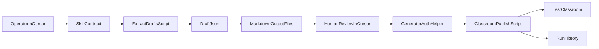

# Generator Skill Implementation Plan

## Goal

Build a separate, skill-driven Google Classroom test generator that:

- accepts screenshots plus short notes
- produces structured coursework drafts
- writes reviewable markdown output files for those drafts
- supports human review in Cursor
- publishes approved items into a teacher-owned test class
- does not add write auth or UI to the main StudyBuddy app

## Current Baseline

Useful reference code already exists in the app, but it should remain read-only:

- [backend/app/routes/auth_google.py](/Users/hedman-admin/study-buddy/backend/app/routes/auth_google.py): existing app OAuth flow with read-only Classroom scopes
- [backend/app/services/classroom.py](/Users/hedman-admin/study-buddy/backend/app/services/classroom.py): read-only Classroom fetch logic and normalization
- [backend/app/models/schemas.py](/Users/hedman-admin/study-buddy/backend/app/models/schemas.py): normalized assignment/material/announcement models to borrow shape ideas from

Separate generator groundwork already exists:

- [test generator/.env.example](/Users/hedman-admin/study-buddy/test%20generator/.env.example)
- [test generator/.gitignore](/Users/hedman-admin/study-buddy/test%20generator/.gitignore)
- [test generator/README.md](/Users/hedman-admin/study-buddy/test%20generator/README.md)
- [docs/backlog/classroom_test_seeder_e7e3fc6c.plan.md](/Users/hedman-admin/study-buddy/docs/backlog/classroom_test_seeder_e7e3fc6c.plan.md)

## Recommended Structure

Keep instructions in the project skill and runtime state in the isolated generator folder.

- Skill contract:
  - [.cursor/skills/classroom-test-generator/SKILL.md](/Users/hedman-admin/study-buddy/.cursor/skills/classroom-test-generator/SKILL.md)
  - [.cursor/skills/classroom-test-generator/reference.md](/Users/hedman-admin/study-buddy/.cursor/skills/classroom-test-generator/reference.md)
  - [.cursor/skills/classroom-test-generator/examples.md](/Users/hedman-admin/study-buddy/.cursor/skills/classroom-test-generator/examples.md)
- Runtime code and artifacts:
  - [test generator/scripts/](/Users/hedman-admin/study-buddy/test%20generator/scripts)
  - [test generator/drafts/](/Users/hedman-admin/study-buddy/test%20generator/drafts)
  - [test generator/runs/](/Users/hedman-admin/study-buddy/test%20generator/runs)
  - [test generator/uploads/](/Users/hedman-admin/study-buddy/test%20generator/uploads)
  - [test generator/tokens/](/Users/hedman-admin/study-buddy/test%20generator/tokens)

## Phase 1: Create the Skill Contract

Create the project skill first so the workflow is stable before any deeper implementation.

Files to add:

- [.cursor/skills/classroom-test-generator/SKILL.md](/Users/hedman-admin/study-buddy/.cursor/skills/classroom-test-generator/SKILL.md)
- [.cursor/skills/classroom-test-generator/reference.md](/Users/hedman-admin/study-buddy/.cursor/skills/classroom-test-generator/reference.md)
- [.cursor/skills/classroom-test-generator/examples.md](/Users/hedman-admin/study-buddy/.cursor/skills/classroom-test-generator/examples.md)

What the skill should define:

- trigger phrases such as `generate classroom test content` and `recreate assignments from screenshots`
- the required input bundle: screenshots, notes, optional course override, publish mode
- the review checkpoint before publish
- the exact helper scripts the agent may run
- a rule that the app’s existing auth flow and iOS UI must not be reused for writes

## Phase 2: Define the Draft Contract and Markdown Output

Create a stable draft format before writing any auth or publish logic.

Add a generator-specific schema reference in either:

- [.cursor/skills/classroom-test-generator/reference.md](/Users/hedman-admin/study-buddy/.cursor/skills/classroom-test-generator/reference.md)
- or [test generator/scripts/models.py](/Users/hedman-admin/study-buddy/test%20generator/scripts/models.py)

Recommended draft data shape:

- `courseId` or `courseName`
- `itemType` such as `assignment`, `material`, `announcement`
- `title`
- `description`
- `dueDate`
- `attachments`
- `confidence`
- `sourceImages`
- `reviewNotes`

Also define a human-friendly markdown output format saved under [test generator/drafts/](/Users/hedman-admin/study-buddy/test%20generator/drafts), for example one file per extracted item or one file per screenshot batch.

Recommended markdown sections:

- source screenshots
- inferred course
- inferred item type
- title
- description or instructions
- due date if visible
- attachments
- confidence and open questions
- suggested Classroom payload preview

This should intentionally resemble the normalized structures in [backend/app/models/schemas.py](/Users/hedman-admin/study-buddy/backend/app/models/schemas.py) without coupling the generator to app code.

## Phase 3: Build Local Generator Scripts

Add small Python helpers in the isolated generator area.

Files to create next:

- [test generator/scripts/extract_drafts.py](/Users/hedman-admin/study-buddy/test%20generator/scripts/extract_drafts.py)
- [test generator/scripts/write_markdown.py](/Users/hedman-admin/study-buddy/test%20generator/scripts/write_markdown.py)
- [test generator/scripts/auth_helper.py](/Users/hedman-admin/study-buddy/test%20generator/scripts/auth_helper.py)
- [test generator/scripts/publish_classroom.py](/Users/hedman-admin/study-buddy/test%20generator/scripts/publish_classroom.py)
- [test generator/scripts/state_db.py](/Users/hedman-admin/study-buddy/test%20generator/scripts/state_db.py)

Responsibilities:

- `extract_drafts.py`: convert screenshots plus notes into structured draft JSON
- `write_markdown.py`: turn draft JSON into readable `.md` output files for review
- `auth_helper.py`: perform separate generator OAuth and persist tokens under `test generator/tokens/`
- `publish_classroom.py`: publish approved drafts to Classroom and Drive
- `state_db.py`: track draft hashes, created item IDs, and rerun protection

## Phase 4: Deliver Markdown-Only v1

Before touching OAuth again, prove the agent workflow with local artifacts only.

Markdown-only milestone requirements:

- accept screenshots and short notes
- generate normalized draft JSON
- generate one or more markdown files under [test generator/drafts/](/Users/hedman-admin/study-buddy/test%20generator/drafts)
- let the operator review those files in Cursor
- support iterative refinement without any Google API calls

The first implementation milestone should end here.

## Phase 5: Harden Auth Before Retrying Google Sign-In

Before doing more live auth attempts, explicitly address the blockers already encountered.

Implementation tasks:

- add a short auth troubleshooting section to the skill docs
- ensure the auth helper reads only generator config from [test generator/.env.local](/Users/hedman-admin/study-buddy/test%20generator/.env.local)
- support safe token reset if a sign-in attempt is partially completed
- document the expected Google Cloud setup:
  - required scopes configured in OAuth Data Access
  - app audience/testing state verified
  - teacher account added as a test user when applicable
  - client secret rotation after exposed or repeated failed tests

The first auth milestone should only prove:

- sign-in succeeds
- token file is saved
- active Classroom courses can be listed

## Phase 6: Implement Publish v1

Start with the smallest safe write path, then add file uploads.

Publishing order:

1. create `DRAFT` course materials with simple links
2. create `DRAFT` assignments
3. upload small files to Drive and attach them as `driveFile`
4. optionally add announcements

Google APIs/scopes to target in the generator only:

- Classroom API for `courseWork`, `courseWorkMaterials`, and `announcements`
- Drive API for uploaded attachments

## Phase 7: Add Review and Idempotency

Make the generator safe to rerun.

Required behaviors:

- save extracted drafts under [test generator/drafts/](/Users/hedman-admin/study-buddy/test%20generator/drafts)
- record publish runs under [test generator/runs/](/Users/hedman-admin/study-buddy/test%20generator/runs)
- hash screenshot sets or final drafts before publish
- skip or warn on likely duplicates
- default new publishes to `DRAFT`

## Milestone Order

### Milestone A

Create the skill files plus the draft JSON and markdown contract.

### Milestone B

Create script placeholders and local state directories, then generate markdown files from sample screenshots.

### Milestone C

Get generator auth working cleanly and list courses.

### Milestone D

Publish one draft material with a link.

### Milestone E

Add screenshot extraction and Drive-backed attachments.

## Success Criteria

- The generator exists as a project skill, not an app feature
- All generator secrets and tokens stay under `test generator/`
- The skill can produce reviewable markdown files and draft JSON from screenshots plus notes
- The markdown-only workflow is useful before any Google auth or write access is available
- Auth uses a separate Google OAuth client and separate token storage
- The first live publish creates a `DRAFT` Classroom item in the target test class
- Re-running the same draft set does not create obvious duplicates

