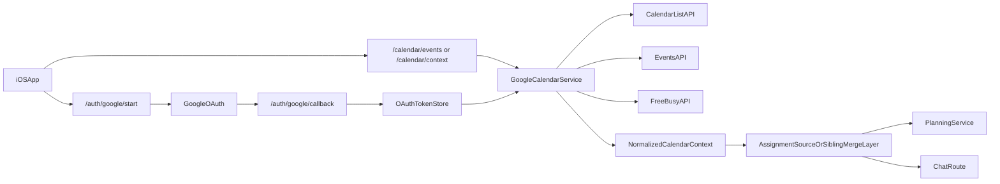

# Google Calendar Read Endpoint

## Recommendation

Start with a **read-only Calendar integration** that supplements, rather than replaces, Google Classroom.

Recommended default behavior:

- Keep Google Classroom as the primary source of truth for assignment identity and canonical assignment deadlines.
- Use Google Calendar for two narrower jobs:
  - detect deadline-like calendar events that Classroom does not contain
  - detect schedule conflicts / free-busy constraints that should influence planning and coaching
- Request Calendar scopes **incrementally** when the user explicitly enables the feature, instead of adding them to the first Classroom consent flow.

## What Exists Today

The backend already has the main plumbing needed for another Google API:

- OAuth start/callback and token persistence live in [backend/app/routes/auth_google.py](/Users/hedman-admin/study-buddy/backend/app/routes/auth_google.py).
- Stored Google tokens are keyed by the Google `sub` in SQLite via [backend/app/core/db.py](/Users/hedman-admin/study-buddy/backend/app/core/db.py).
- Protected Google-backed endpoints already exist for Classroom in [backend/app/routes/classroom.py](/Users/hedman-admin/study-buddy/backend/app/routes/classroom.py).
- Token refresh + Google API calling patterns already exist in [backend/app/services/classroom.py](/Users/hedman-admin/study-buddy/backend/app/services/classroom.py).
- Planning and chat both consume one normalized assignment feed from [backend/app/services/assignment_source.py](/Users/hedman-admin/study-buddy/backend/app/services/assignment_source.py), then fan out into [backend/app/services/planning.py](/Users/hedman-admin/study-buddy/backend/app/services/planning.py) and [backend/app/routes/chat.py](/Users/hedman-admin/study-buddy/backend/app/routes/chat.py).

## Relevant Google Calendar API Surface

Most useful read-oriented endpoints for this product are:

- `GET /users/me/calendarList`
Purpose: discover which calendars the user has and which one(s) should be considered.
- `GET /calendars/{calendarId}/events`
Purpose: read concrete events from `primary` or another chosen calendar, filtered by time window.
- `POST /freeBusy`
Purpose: get busy blocks without needing full event detail, useful for planning around conflicts.
- Optional: `GET /calendars/{calendarId}` for metadata and `GET /users/me/settings` for user timezone/settings.

Recommended scopes to start with:

- `https://www.googleapis.com/auth/calendar.events.readonly`
- `https://www.googleapis.com/auth/calendar.calendarlist.readonly`

Only use `https://www.googleapis.com/auth/calendar.readonly` if you later decide you need broader access with fewer API constraints. Prefer the narrower scopes first.

## Architecture Shape

Suggested backend layering:

- Add a new service beside Classroom, for example `backend/app/services/calendar.py`.
- Reuse or extract shared token-refresh logic from `classroom.py` so Calendar and Classroom do not duplicate OAuth refresh code.
- Add a protected route beside Classroom, for example `GET /calendar/events` for debugging/raw inspection and optionally `GET /calendar/context` for normalized app-facing output.
- Feed merged output into [backend/app/services/assignment_source.py](/Users/hedman-admin/study-buddy/backend/app/services/assignment_source.py) or a sibling merge service so both planning and chat see the same interpretation.

## Merge And Conflict Policy

Recommended default merge policy:

- **Classroom wins for assignment identity**: if the same piece of work exists in Classroom and Calendar, keep the Classroom assignment ID as canonical.
- **Classroom wins for explicit course deadlines** unless Calendar evidence is stronger and clearly more specific.
- **Calendar adds context** instead of silently overwriting:
  - `calendar_deadline_candidate`
  - `calendar_conflict_blocks`
  - `calendar_supporting_event_ids`
  - `deadline_confidence`
- **Planner/chat consume the merged view**, not raw Calendar events.

Practical decision rules:

- If a Classroom assignment has no due date and Calendar has a close title/time match, attach the Calendar deadline as a suggested due date with lower confidence.
- If both sources have due dates but differ slightly, keep both internally and expose one chosen `effectiveDueDate` plus a `conflictReason` for ranking/debugging.
- If the dates differ materially, prefer Classroom for the displayed assignment deadline but let Calendar affect urgency wording and scheduling suggestions.
- Use `freeBusy` or event windows to avoid recommending study blocks during classes or other busy periods.
- Do not let Calendar create duplicate assignments unless there is no plausible Classroom match.

Matching heuristics for a first version:

- normalized title similarity
- time proximity
- optional course name keyword overlap
- optional link/description overlap

## Product Risks And Constraints

- Existing users would need re-consent for new scopes if the same OAuth flow is reused.
- The current token store is simple SQLite; Google recommends secure encrypted storage for tokens at rest.
- Current backend error handling flattens several upstream Google auth/scope failures into generic API failures, so re-auth UX may need improvement.
- The current “agent” is not tool-calling; it only sees backend-provided prompt data. Calendar data must therefore be fetched and merged server-side before planning/chat.

## Proposed Spike Sequence

1. Validate scope choice and consent UX.
2. Build a thin Calendar service that can list calendars and fetch events from `primary` within a time window.
3. Add a debug endpoint that returns normalized Calendar events for the signed-in user.
4. Design a merged schema that preserves provenance and confidence instead of collapsing conflicts too early.
5. Inject merged output into the existing assignment source path and test how planning/chat change.
6. Decide whether `freeBusy` should be phase 1 or phase 2 based on how much schedule-awareness you want versus pure deadline extraction.

## Likely Files To Touch Later

- [backend/app/routes/auth_google.py](/Users/hedman-admin/study-buddy/backend/app/routes/auth_google.py)
- [backend/app/services/classroom.py](/Users/hedman-admin/study-buddy/backend/app/services/classroom.py)
- [backend/app/services/assignment_source.py](/Users/hedman-admin/study-buddy/backend/app/services/assignment_source.py)
- [backend/app/models/schemas.py](/Users/hedman-admin/study-buddy/backend/app/models/schemas.py)
- [backend/app/main.py](/Users/hedman-admin/study-buddy/backend/app/main.py)
- [docs/OAUTH_SETUP.md](/Users/hedman-admin/study-buddy/docs/OAUTH_SETUP.md)
